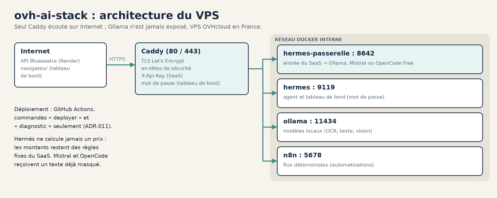

<div align="center">


### ovh-ai-stack : l'IA auto-hébergée de Blueseatra

Ollama, Hermes Agent et n8n sur un VPS OVH en France, derrière Caddy. Les documents clients ne quittent pas l'UE par défaut.

     

[**Guide d'installation**](docs/GUIDE-POWERSHELL.md) · [**Exploitation Hermès**](docs/EXPLOITATION-HERMES.md) · [**Sécurité**](docs/SECURITE.md) · [**RGPD**](docs/RGPD.md) · [**Décisions (ADR)**](docs/decisions/) · [**SaaS Blueseatra**](https://github.com/zehair-louzza/Blueseatra) · [**Licence**](./LICENSE)

</div>

---

## En bref

| Sujet | En pratique |
|---|---|
| **Rôle** | Moteur IA privé du SaaS [Blueseatra](https://github.com/zehair-louzza/Blueseatra) : extraction, vision, rédaction des descriptifs |
| **Exposition** | Seul Caddy écoute sur Internet (80/443, clé `X-Api-Key`) ; Ollama (11434) n'est jamais exposé |
| **Règle d'or** | Hermes Agent n'a pas le droit de calculer un prix : les montants restent des règles fixes du SaaS |
| **Données** | Hébergement en France, aucun envoi hors UE par défaut |

## Pourquoi un dépôt à part

- Blueseatra = produit SaaS (FastAPI / React / Supabase)
- OracleMind = produit MCP Oracle (inchangé)
- Ce dépôt = infra VPS (secrets, volumes, durcissement)

Voir [ADR-001](docs/decisions/ADR-001-ovh-remplace-oracle.md).

## Architecture



Schéma généré par [`scripts/docs/generer_schemas_ecosysteme.py`](https://github.com/zehair-louzza/Blueseatra/blob/main/scripts/docs/generer_schemas_ecosysteme.py) dans le dépôt Blueseatra, d'après `compose.yaml` et `caddy/Caddyfile` (état au 10/10/2026).

<details>
<summary>Vue texte</summary>

```
Internet
   │  80 / 443
   ▼
 Caddy (TLS, en-têtes de sécurité)
   ├── PUBLIC_DOMAIN  → ollama:11434             (X-Api-Key obligatoire)
   ├── N8N_HOST       → n8n:5678
   └── HERMES_HOST
         ├── avec X-Api-Key → hermes-passerelle:8642  (entrée du SaaS, /v1, config en lecture seule)
         └── sans clé       → hermes:9119             (tableau de bord, mot de passe)
```

</details>

FastAPI (Render, Francfort) appelle `https://$PUBLIC_DOMAIN/api/chat` avec `X-Api-Key`.
n8n déclenche les flux déterministes. Hermes Agent n'a pas le droit de calculer un prix.

Slots Hermes (état réel au 25/08/2026 — voir [ADR-006](docs/decisions/ADR-006-gpt-oss-reasoning-model-graduated-effort.md) et [ADR-007](docs/decisions/ADR-007-reactivation-toolsets-et-reasoning-high.md) ; ADR-002/ADR-003 sont l'historique de la config initiale, remplacée depuis) :

| Rôle Blueseatra | Clé Hermes | Modèle |
|---|---|---|
| Raisonnement (agent Hermes) | `model` + `agent.reasoning_effort: high` | `gpt-oss:20b` |
| Vision (slot auxiliaire, seul modèle multimodal) | `auxiliary.vision` | `qwen2.5vl:7b` |
| Extraction légère / tâches rapides | `auxiliary.web_extract` | `gpt-oss:20b` |
| Secours si `gpt-oss:20b` échoue | `fallback_providers` | `hermes3` |
| Génération devis SaaS — raisonnement/extraction | hors Hermes (FastAPI → Ollama, `HERMES_REASONING_MODEL`) | `gpt-oss:20b` |
| Génération devis SaaS — Description + Étapes uniquement | hors Hermes (FastAPI → Ollama, `HERMES_DESCRIPTION_MODEL`) | `glm-4.7-flash:Q3_K_M` |

`gemma4:26b`, `qwen3.6:27b`, `qwen3:14b`, `deepseek-r1:14b`, `qwen2.5:14b` et `Phi-4-reasoning-vision-15B` ont été retirés du VPS le 23/08/2026 (63 Go libérés, aucun ne raisonnait ET n'avait la vision à la fois) — ne plus les réinstaller.

### Mémoire persistante / apprentissage autonome

Hermes Agent a une boucle d'apprentissage intégrée (mémoire persistante `MEMORY.md`/`USER.md`, création/amélioration autonome de skills) activée par défaut. Elle a été vérifiée en réel le 25/08/2026 : un bug d'usage de l'outil `memory` (action invalide) la rendait totalement inopérante, corrigé et renforcé dans `hermes/SOUL.md` (section « Mémoire persistante — apprentissage autonome ») — voir [ADR-008](docs/decisions/ADR-008-hermes-apprentissage-autonome-fiabilite.md).

## Prérequis déjà faits sur le VPS

- Ubuntu 24.04.4 — `ubuntu@vps-b377201e.vps.ovh.net`
- Docker 29.7.2 + Compose v5.4.0
- UFW 22 / 80 / 443
- Swap 4 Go

Installation terminée : la pile est en production (`ia`, `n8n` et `hermes`.blueseatra.com). Les mises à jour se déploient depuis GitHub Actions, par les seules commandes « deployer » et « diagnostic » ([ADR-011](docs/decisions/ADR-011-deploiement-automatique-vps.md)).

## Suite de l'installation

Guide unique, commandes **une par une** (PowerShell casse les pipes multi-lignes) :

→ **[docs/GUIDE-POWERSHELL.md](docs/GUIDE-POWERSHELL.md)**

## Exploitation

- [docs/EXPLOITATION-HERMES.md](docs/EXPLOITATION-HERMES.md) : modèle du tableau de bord, clés API, extensions de la passerelle (OpenCode Free), modèles Ollama, dépôt du VPS propre
- [docs/decisions/ADR-013-config-agent-volume-et-opencode-free.md](docs/decisions/ADR-013-config-agent-volume-et-opencode-free.md)

## RGPD / sécurité

- [docs/RGPD.md](docs/RGPD.md)
- [docs/SECURITE.md](docs/SECURITE.md)
- [docs/DECOMMISSION-ORACLE.md](docs/DECOMMISSION-ORACLE.md)

## Sources officielles

- [Ollama Docker](https://docs.ollama.com/docker)
- [Ollama bind / OLLAMA_HOST](https://docs.ollama.com/faq)
- [Hermes Agent Docker](https://hermes-agent.nousresearch.com/docs/user-guide/docker)
- [Hermes configuration](https://hermes-agent.nousresearch.com/docs/user-guide/configuration)
- [Hermes API server](https://hermes-agent.nousresearch.com/docs/user-guide/features/api-server)
- [Hermes extension oc-free-provider](https://hermes-agent.nousresearch.com/docs/plugins/oc-free-provider)
- [OpenCode Zen : modèles et données](https://opencode.ai/docs/zen/)
- [n8n Docker Compose](https://docs.n8n.io/deploy/host-n8n/install-options/use-a-cloud-provider/use-docker-compose)
- [Caddy matchers](https://caddyserver.com/docs/caddyfile/matchers)
- [gpt-oss](https://ollama.com/library/gpt-oss) · [qwen2.5vl](https://ollama.com/library/qwen2.5vl) · [hermes3](https://ollama.com/library/hermes3)
- [Hermes Agent — Mémoire persistante](https://hermes-agent.nousresearch.com/docs/user-guide/features/memory)

## Licence

Logiciel **propriétaire**. Titulaire des droits : **Zehair Louzza**, exploitant le nom commercial « Blueseatra ». Le texte qui fait foi est le fichier [LICENSE](./LICENSE), version 2.0 du 10 octobre 2026.

| Point | En pratique |
|---|---|
| Ce qui est protégé | Configuration, scripts, consignes et compétences de l'agent, documentation, schémas, nom et logo |
| Ce que la publication sur GitHub permet | Consulter le dépôt et le dupliquer (« fork ») sur GitHub, comme l'imposent les conditions de GitHub. Rien d'autre |
| Ce qui est interdit sans accord écrit | Copier, déployer, modifier, redistribuer, proposer en service, bâtir un produit concurrent |
| Intelligence artificielle | Opposition à la fouille de textes et de données (article L.122-5-3 du CPI) : aucun entraînement de modèle sur ce dépôt |
| Composants de tiers | Ollama, Hermes Agent, n8n, Caddy et les modèles restent sous leurs propres licences |
| Sécurité | Faille à signaler en privé selon [SECURITY.md](./SECURITY.md) |
| Droit applicable | Droit français, tribunaux du ressort de la cour d'appel de Paris |

Demande d'autorisation : `contact@blueseatra.com`.

---

<sub>© 2025-2026 Zehair Louzza, exploitant le nom commercial « Blueseatra ». Logiciel propriétaire, tous droits réservés. Voir [LICENSE](./LICENSE).</sub>
